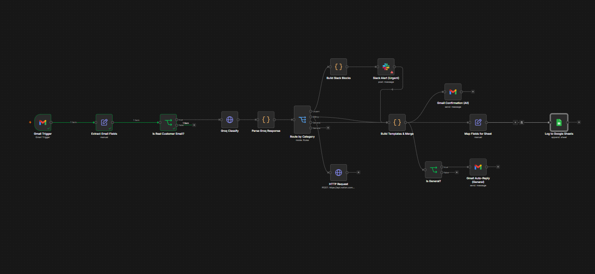

<div align="center">

# AI-Powered Customer Support Ticket Router

**Automatically classify, route, and respond to support emails using AI**


> A self-hosted n8n workflow that watches your Gmail inbox, classifies each support email with Llama 3.3 (via Groq's free API), and routes it to Slack, Notion, or an auto-reply. Every ticket is confirmed and logged to Google Sheets automatically.



</div>

---

## What It Does

| Category | Action |
|----------|--------|
| Urgent | Posts a formatted alert to Slack |
| Billing | Creates a ticket page in Notion |
| General | Sends an FAQ-pointer auto-reply |
| All tickets | Sends a confirmation email + logs a row in Google Sheets |

---

## How It Works

```
Gmail Inbox
    |
    v
[ Loop Guard ] -- drops bot's own replies and already-tracked tickets
    |
    v
[ Groq / Llama 3.3 ] -- classifies email into Urgent / Billing / General
    |
    +---> Urgent  -->  Slack alert (formatted blocks)
    |
    +---> Billing -->  Notion ticket page (via REST API)
    |
    +---> General -->  FAQ auto-reply email
    |
    v
[ Google Sheets ] -- universal ticket log row
[ Gmail ] -- universal confirmation email sent to sender
```

1. **Gmail Trigger** polls your support inbox for new mail.
2. **Loop Guard** drops anything sent from the bot's own address or already carrying an internal ticket reference, preventing infinite reply loops.
3. **Groq Classify** sends the email body to Llama 3.3 with a structured prompt and receives a category and urgency level.
4. **Route by Category** fans the ticket out to the right destination.
5. Every ticket gets a confirmation email and a logged row in Google Sheets, regardless of category.

---

## Tech Stack

| Tool | Role |
|------|------|
| n8n (Docker) | Workflow automation engine |
| Groq API (Llama 3.3 70B) | Email classification (free tier) |
| Gmail API | Inbox trigger, confirmation emails, FAQ replies |
| Slack API | Urgent ticket alerts |
| Notion REST API | Billing ticket creation |
| Google Sheets API | Universal ticket log |

> No OpenAI dependency. Classification runs entirely on Groq's free, fast inference API.

---

## Setup

### Prerequisites

- Docker and Docker Compose installed
- A Google account (Gmail + Sheets)
- A Slack workspace
- A Notion account
- A free [Groq API key](https://console.groq.com)

### Steps

**1. Clone the repo**
```bash
git clone https://github.com/your-username/ai-support-router-n8n.git
cd ai-support-router-n8n
```

**2. Configure environment variables**
```bash
cp .env.example .env
# Open .env and fill in your real API keys and config values
```

**3. Start n8n**
```bash
docker compose up -d
```

**4. Import the workflow**

Open [http://localhost:5678](http://localhost:5678), import `workflow.json`, and connect your Gmail, Slack, and Google Sheets credentials in the n8n UI.

> Notion auth is handled via `NOTION_TOKEN` in `.env` directly, not through an n8n credential node.

**5. Set up your Notion database**

Create a Notion database with these columns:

| Column | Type |
|--------|------|
| Name | Title |
| Sender | Text |
| Category | Select |
| Urgency | Select |
| Status | Select |
| Ticket Ref | Text |
| Received | Date |
| Notes | Text |

Then share the database with your Notion integration via the database's `... > Connections` menu.

**6. Activate the workflow** and send a test email.

---

## Project Structure

```
ai-support-router-n8n/
|
|-- workflow.json           Importable n8n workflow definition
|-- docker-compose.yml      n8n container setup and env wiring
|-- .env.example            Safe template for required secrets
|-- prompts/                Groq classification prompt
|-- templates/              HTML email templates per category
|-- docs/                   Additional notes and screenshots
|-- scripts/                Helper scripts
```

---

## Notable Fix: Self-Reply Loop Prevention

During testing, the bot's own auto-reply was picked up by the Gmail trigger as a new incoming message, which got classified and replied to again, forever.

**Fix:** A loop guard node drops any email sent from the bot's own address, or whose subject already contains an internal ticket reference marker. The bot can never reply to its own replies.

---

## License

MIT
